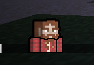

# Serverside Avatar renderer

Renders player skins as avatar image.

## Text Placeholder:
`%avatar-renderer:avatar <player-name> <offset> <flipped>%`

Offset moves the avatar down by N amount.

Flipped causes the image to be flipped

## Example:

`%avatar-renderer:avatar Pinnit%`

`%avatar-renderer:avatar Pinnit 0%`

`%avatar-renderer:avatar Pinnit 0 flipped%`

